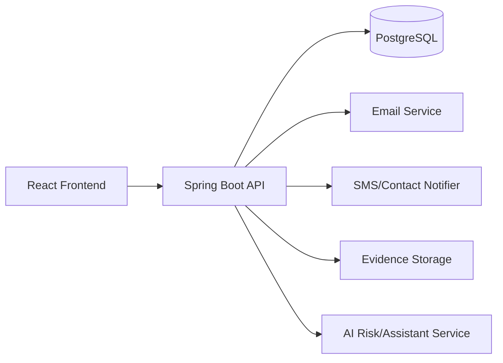

# SafeHer Master Design Blueprint

Date: 2026-06-19
Owner: Product + Engineering
Status: Draft v1 (Design Freeze Candidate)

## 1. Vision and Positioning

SafeHer is a safety-first platform focused on emergency response, trusted contact escalation, incident reporting, and explainable behavior-risk intelligence (Guardian Twin).

Primary promise:
- Fast emergency action (`SOS` in less than 3 seconds from tap to backend acceptance)
- Trustworthy guidance (AI assistant with safe-action prompts)
- Integrity of evidence (tamper-visible files and audit-ready timeline)
- Privacy and least-privilege access controls

## 2. Product Scope (v1 -> v2)

### In Scope (v1)
- User auth (register/login/JWT)
- Profile and role-aware access
- Emergency contacts CRUD
- SOS incident creation and contact notifications
- Incident reporting and history
- Guardian Twin profile + check-in + evidence verification
- AI assistant safety prompt endpoint
- Notification feed in frontend

### Next Scope (v2)
- Rate limiting and abuse protection
- Push notifications + delivery receipts
- Officer workflow board and triage SLA
- Rich telemetry dashboards
- PWA offline queue for incident drafts

## 3. User Roles and Permission Matrix

Roles:
- ROLE_USER: can manage own data, own contacts, own incidents
- ROLE_OFFICER: can update incident statuses and monitor escalations
- ROLE_ADMIN: full supervisory access (users + incidents)

Permission matrix:
- Register/login: public
- Read own profile: user/officer/admin
- Contacts CRUD: owner only
- Create incident/SOS: authenticated user
- Read incidents:
  - user: own incidents
  - admin/officer: all incidents via admin endpoints
- Update incident status: officer/admin only
- Evidence upload/download: authenticated, scoped by incident ownership or role policy

## 4. UX and Information Architecture

Frontend routes currently implemented:
- `/` Home
- `/login`, `/register`
- `/dashboard`
- `/contacts`
- `/report`, `/report-incident`
- `/tracking`
- `/ai`
- `/guardian-twin`
- `/history`
- `/profile`
- `/notifications`

### Core User Journeys

1. Onboarding
- Register -> login -> land on dashboard -> create trusted contacts

2. Emergency Journey
- Tap SOS -> location acquired -> backend incident created -> contacts notified -> notification shown -> incident visible in history

3. Incident Journey
- Submit report -> AI risk score generated -> admin/officer sees escalation queue -> status transitions tracked

4. Guardian Journey
- Set normal profile -> run check-ins -> anomaly/risk score updates -> evidence autopilot -> verify integrity

## 5. System Architecture (Design)

### Backend Bounded Areas
- Auth and identity
- Contacts
- Incidents and SOS
- Guardian Twin (profile/check-in/evidence)
- Admin and triage
- Notifications

## 6. API Contract Freeze (Current + Target)

### Auth and user
- `POST /api/auth/register`
- `POST /api/auth/login`
- `GET /api/user/me`

### Contacts
- `GET /api/contacts`
- `POST /api/contacts`
- `PUT /api/contacts/{id}`
- `DELETE /api/contacts/{id}`

### Incidents and SOS
- `POST /api/incidents`
- `GET /api/incidents` (user-own list)
- `PUT /api/incidents/{id}/status` (officer/admin)
- `POST /api/sos`

### Admin views
- `GET /api/admin/users`
- `PUT /api/admin/incidents/{id}/status`
- `GET /api/admin/incidents?status=...`

### Guardian Twin
- `GET /api/guardian-twin/profile`
- `PUT /api/guardian-twin/profile`
- `POST /api/guardian-twin/check-in`
- `GET /api/guardian-twin/check-ins`
- `GET /api/guardian-twin/evidence/{evidenceId}/verify`

### Evidence
- `GET /api/evidence/test`
- `POST /api/evidence/upload/{incidentId}`
- `GET /api/evidence/incident/{incidentId}`
- `GET /api/evidence/download/{evidenceId}`

### AI
- `POST /api/ai/ask`

## 7. Data Model Design

Core entities:
- User
- EmergencyContact
- Incident
- Evidence
- GuardianProfile
- GuardianCheckIn

### Incident lifecycle states
- NEW
- INVESTIGATING
- ESCALATED
- RESOLVED

### Incident transition policy
- NEW -> INVESTIGATING
- INVESTIGATING -> ESCALATED or RESOLVED
- ESCALATED -> RESOLVED
- RESOLVED is terminal unless explicitly reopened by admin (future)

## 8. Security Design

### Authentication
- JWT bearer token for stateless auth
- Short-lived access token (target: 15-60 minutes) and refresh strategy in v2

### Authorization
- Route-level plus method-level guards
- Resource ownership checks for user-scoped resources

### Input protection
- DTO validation on all write operations
- Global exception mapping to safe API responses

### Secret management
- No hardcoded production secrets
- Required env vars for JWT, DB, mail, Twilio, AI keys

### Abuse protection (next implementation)
- Login: strict IP+account rate limit
- SOS: user-based burst + minute window cap
- AI ask: user+IP throttling with daily cap

### Evidence integrity
- SHA-256 hash at ingest
- Re-hash on verification requests
- Audit trail for create/view/download

## 9. Reliability and Ops Design

SLO targets:
- SOS API acceptance p95 < 700ms
- Contact notification initiation < 2s after incident save
- API availability >= 99.9%

Resilience patterns:
- Retry with jitter for external notifications
- Dead-letter strategy for failed notifications (v2)
- Circuit breaker/timeouts for external AI or SMS adapters

## 10. Frontend Design System and UX Rules

Design principles:
- Mobile-first, high-contrast, accessibility-first controls
- Critical actions always visible (SOS, check-in, call contact)
- Explicit loading/empty/error/success states on each screen

Component system targets:
- Unified card/button/input/badge primitives
- Standard toast and status-pill semantics
- Route-level skeleton loaders

Accessibility requirements:
- Keyboard navigation for all actionable controls
- ARIA labels for safety-critical buttons
- Color contrast >= WCAG AA

## 11. Testing and Quality Gates

### Frontend
- ESLint clean required
- Smoke tests for login/dashboard/SOS flow (Playwright target)

### Backend
- Unit tests for security helpers and services
- Controller-level tests for validation/error mapping
- Authorization regression tests for protected operations

### Gate policy
- No merge unless:
  - frontend lint passes
  - backend tests pass
  - critical security tests pass

## 12. CI/CD Design

Pipeline stages:
1. Frontend lint/build
2. Backend compile/tests
3. Security checks (dependency and secret scanning)
4. Artifact build
5. Deploy to staging
6. Manual approval for production

## 13. Observability Design

Logging standard:
- Correlation ID per request
- Structured JSON logs for incident/SOS lifecycle

Metrics:
- `sos_requests_total`, `sos_failed_total`
- `incident_created_total`, `incident_status_change_total`
- `ai_ask_total`, `ai_ask_rate_limited_total`
- API latency p50/p95/p99

Alerts:
- SOS error rate > 2% in 5 minutes
- Incident API p95 > 1.5s for 10 minutes
- Notification delivery failures spike threshold

## 14. Delivery Roadmap (Design-first execution)

### Phase A: Foundation Hardening (1 week)
- Rate limiting for login/SOS/AI
- Endpoint ownership audit
- Remove test-only controller endpoints from prod profile

### Phase B: Reliability and Triage (1-2 weeks)
- Officer/admin triage dashboard APIs
- Notification retry strategy and statuses
- Incident transition guardrails

### Phase C: UX and Product Maturity (2 weeks)
- Full design system pass
- Accessibility and responsive stabilization
- Better Guardian Twin explainability cards

### Phase D: Production Readiness (1 week)
- CI/CD full gates
- Observability dashboards
- Release checklist and runbooks

## 15. Immediate Execution Order (after design freeze)

1. Implement rate limiter middleware/interceptor in backend
2. Add endpoint-level policies:
- `/api/auth/login`: strict
- `/api/sos`: emergency abuse-safe
- `/api/ai/ask`: bounded consumption
3. Add integration tests for rate-limit responses (`429`)
4. Add CI workflow for frontend lint + backend tests
5. Add staging config and readiness checklist

## 16. Non-Negotiable Engineering Standards

- No secret defaults in production config
- No unvalidated write endpoint payloads
- No unguarded status mutation endpoints
- Every user-visible failure must return actionable error message
- All safety-critical flows must have automated tests

---

## Appendix A: Design Freeze Checklist

- [ ] API contracts approved by frontend and backend
- [ ] Role/permission matrix approved
- [ ] Incident lifecycle and transition rules approved
- [ ] Security controls approved (JWT + rate limit + validation)
- [ ] Observability metrics and alerts approved
- [ ] CI gate policy approved

## Appendix B: Current Baseline References

Frontend route shell:
- `src/App.jsx`

Security configuration baseline:
- `/Users/harshprajapat/women-safety-backend/src/main/java/com/womensafety/config/SecurityConfig.java`

Primary backend controllers:
- `/Users/harshprajapat/women-safety-backend/src/main/java/com/womensafety/controller/`
